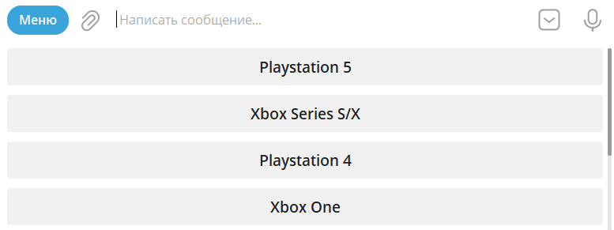
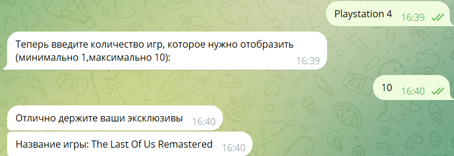
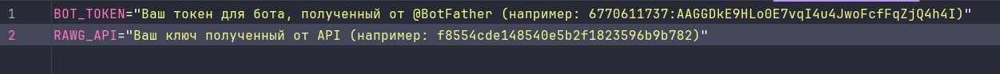

<!-- Improved compatibility of back to top link: See: https://github.com/othneildrew/Best-README-Template/pull/73 -->
<a name="readme-top"></a>
<!--
*** Thanks for checking out the Best-README-Template. If you have a suggestion
*** that would make this better, please fork the repo and create a pull request
*** or simply open an issue with the tag "enhancement".
*** Don't forget to give the project a star!
*** Thanks again! Now go create something AMAZING! :D
-->
<!-- PROJECT LOGO -->
<br />
<div align="center">
  <h3 align="center">myGameStoreBot</h3>
</div>

<!-- ABOUT THE PROJECT -->
## Описание Проекта
Представляю вашему вниманию Telegram-бот, который станет вашим личным гидом в мире гейминга! Данный проект – это универсальный инструмент, созданный с единственной целью: сделать процесс поиска и выбора игр максимально удобным и приятным.
С помощью бота вы сможете быстро найти игру для любой платформы: будь то ПК, консоли PlayStation, Xbox или Nintendo Switch.
Также с помощью бота вы можете выбрать интересующую вас игру и просмотреть её в таких популярных магазинах, как Steam, Epic Games Store, Microsoft Store, Playstation Store и многих других.
<!-- GETTING STARTED -->
### Как пользоваться
Данный бот содержит такие комманды как:
#### custom command:
**/low** - Минимальное, выводит список игр, выпущенных для одной платформы (эксклюзивов).
При вызове бот просит выбрать платформу:
<div align="center">
    
</div>
<br/>
<div align="center">
    
</div>


Запрос с параметрами:
   ```sh
   https://api.rawg.io/api/games?key=f8554cde148540e5b2f1823596b9b782&platforms_count=1&page_size=10&platforms=187
   ```


Пример ответ запроса:
```console
 "results": [
        {
            "slug": "astros-playroom",
            "name": "Astro's Playroom",
            "playtime": 0,
            "platforms": [
                {
                    "platform": {
                        "id": 187,
                        "name": "PlayStation 5",
                        "slug": "playstation5"
                    }
                }
            ],
            "stores": [
                {
                    "store": {
                        "id": 3,
                        "name": "PlayStation Store",
                        "slug": "playstation-store"
                    }
                }
            ],
            "released": "2020-11-12",
            "tba": false,
            "background_image": "https://media.rawg.io/media/games/bfe/bfe7780b7d4342540be2e5273d49e54c.jpg",
            "rating": 4.35,
            "rating_top": 5,
            "ratings": [
                {
                    "id": 5,
                    "title": "exceptional",
                    "count": 260,
                    "percent": 49.62
                },
                {
                    "id": 4,
                    "title": "recommended",
                    "count": 217,
                    "percent": 41.41
                },
                {
                    "id": 3,
                    "title": "meh",
                    "count": 31,
                    "percent": 5.92
                },
                {
                    "id": 1,
                    "title": "skip",
                    "count": 16,
                    "percent": 3.05
                }
            ],
            "ratings_count": 515,
            "reviews_text_count": 6,
            "added": 2301,
            "added_by_status": {
                "yet": 41,
                "owned": 1547,
                "beaten": 537,
                "toplay": 51,
                "dropped": 91,
                "playing": 34
            },
            "metacritic": 83,
            "suggestions_count": 147,
            "updated": "2024-03-20T09:47:28",
            "id": 452646,
            "score": null,
            "clip": null,
            "tags": [
                {
                    "id": 37796,
                    "name": "exclusive",
                    "slug": "exclusive",
                    "language": "eng",
                    "games_count": 4496,
                    "image_background": "https://media.rawg.io/media/games/951/951572a3dd1e42544bd39a5d5b42d234.jpg"
                },
                {
                    "id": 37797,
                    "name": "true exclusive",
                    "slug": "true-exclusive",
                    "language": "eng",
                    "games_count": 3983,
                    "image_background": "https://media.rawg.io/media/games/bfe/bfe7780b7d4342540be2e5273d49e54c.jpg"
                }
            ],
            "esrb_rating": {
                "id": 2,
                "name": "Everyone 10+",
                "slug": "everyone-10-plus",
                "name_en": "Everyone 10+",
                "name_ru": "\u0421 10 \u043b\u0435\u0442"
            },
            "user_game": null,
            "reviews_count": 524,
            "saturated_color": "0f0f0f",
            "dominant_color": "0f0f0f",
            "short_screenshots": [
                {
                    "id": -1,
                    "image": "https://media.rawg.io/media/games/bfe/bfe7780b7d4342540be2e5273d49e54c.jpg"
                },
                {
                    "id": 2408612,
                    "image": "https://media.rawg.io/media/screenshots/a08/a08e091e1912cfac85c5a48f99a28ccb.jpg"
                },
                {
                    "id": 2408613,
                    "image": "https://media.rawg.io/media/screenshots/300/300771025f192c75a76cdd3ed9229dd9.jpg"
                },
                {
                    "id": 2408614,
                    "image": "https://media.rawg.io/media/screenshots/aed/aed6777a3d7ae19e5411ac5b893e8b33.jpg"
                },
                {
                    "id": 2408616,
                    "image": "https://media.rawg.io/media/screenshots/a98/a98bdb667d28da98e58ca69a9fcdf731.jpg"
                }
            ],
            "parent_platforms": [
                {
                    "platform": {
                        "id": 2,
                        "name": "PlayStation",
                        "slug": "playstation"
                    }
                }
            ],
            "genres": [
                {
                    "id": 83,
                    "name": "Platformer",
                    "slug": "platformer"
                },
                {
                    "id": 4,
                    "name": "Action",
                    "slug": "action"
                }
            ]
        }
    ]
```
**/high** - Максимальное, выводит список игр, выпущенных для нескольких платформы (мультиплатформенные игры).
<br/>
**/custom** - Пользовательское, выводит список игр пользовательского диапазона (по жанру, по платформе, по году выпуска).
<br/>
**/history** - история запросов, выводит историю запросов пользователя (последние 10).
#### default command:
**/start** - старт, запуск бота
<br/>
**/help** - помощь, выводит справку по командам бота

### Как запустить
1. Создать теллеграм бота:
   ```sh
   https://t.me/BotFather
   ```
2. Склонировать репозиторий проекта:
   ```sh
   git clone https://gitlab.skillbox.ru/artem_kurlychkin/python_basic_diploma.git
   ```
3. Установить зависимости из файла requirements.txt:
   ```sh
   pip install -r requirements.txt
   ```
4. Создать файл .env с параметрами (пример есть в файле .env.template):
    
